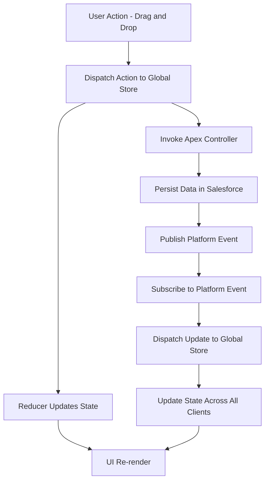

# Data Flow in LWC Kanban Board with Redux-like Global State

## Overview

This document provides an overview of the data flow within the LWC Kanban Board application. The application uses a Redux-like global state management system, along with Apex controllers and Platform Events, to manage and synchronize the state of Kanban cards and columns in real-time across multiple users.

## Data Flow Diagram

## Detailed Steps

1. **User Action - Drag and Drop**

    - A user initiates a drag-and-drop action on a Kanban card. This triggers an event within the UI.

2. **Dispatch Action to Global Store**

    - The drag-and-drop event dispatches an action (e.g., `MOVE_CARD`) to the Redux-like global store.

3. **Reducer Updates State**

    - The dispatched action is processed by a reducer, which updates the local state accordingly.

4. **UI Re-render**

    - Once the state is updated, the affected LWC components re-render to reflect the changes, providing instant visual feedback to the user.

5. **Invoke Apex Controller**

    - To persist the changes, an Apex controller is invoked with the updated card and column information.

6. **Persist Data in Salesforce**

    - The Apex controller updates the relevant Salesforce records, ensuring that the changes are saved.

7. **Publish Platform Event**

    - After the data is persisted, the Apex controller publishes a Platform Event to notify other clients of the changes.

8. **Subscribe to Platform Event**

    - Other users' Kanban boards subscribe to the Platform Event using the `empApi` module.

9. **Dispatch Update to Global Store**

    - Upon receiving the Platform Event, an action is dispatched to update the global store on the other clients.

10. **Update State Across All Clients**

    - The global state is updated on all subscribed clients, ensuring that all users see the latest changes.

11. **UI Re-render**
    - The updated state triggers a re-render of the UI components for all clients, maintaining synchronization.
